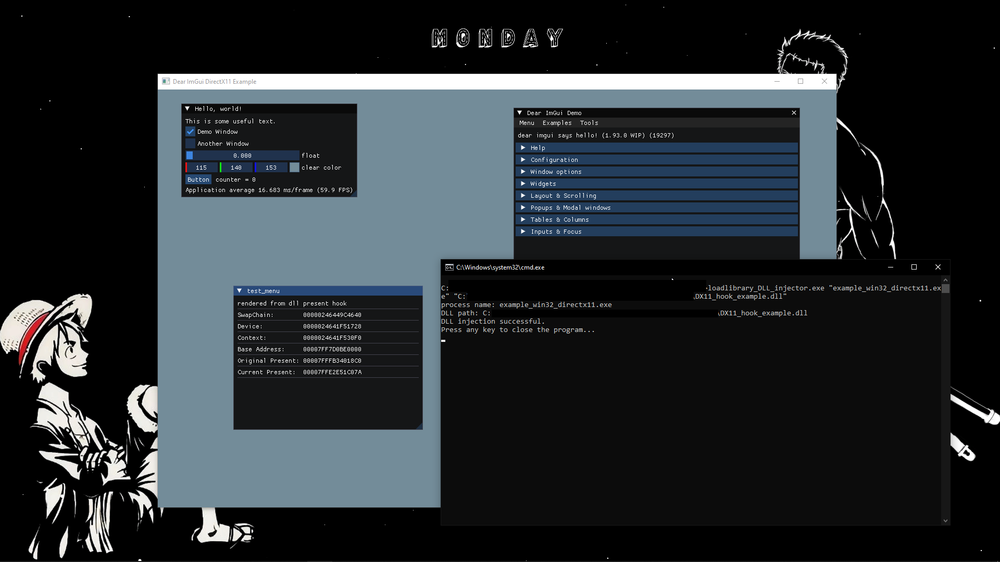
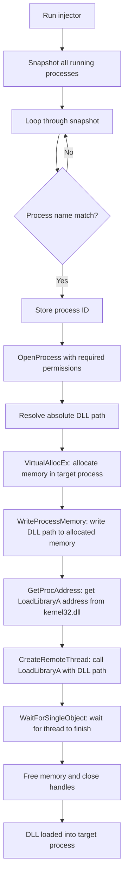

# loadlibrary_DLL_injector


## What is this?

This project is a [loadlibrary](https://learn.microsoft.com/en-us/windows/win32/api/libloaderapi/nf-libloaderapi-loadlibrarya) injector that allows the injection / loading of DLLs into other applications.

## Why did I do it?

I made this project as a continuation of my other project [DX11 Hook Example](https://github.com/ItsJustJoshua/DX11_hook_example) as for that project an injector is needed to load the DLL into the application it is for. In development of that project I used a publicly available injector however this made me wonder about making my own so I learned about loadlibrary and decided to make this simple injector.

## Tools

- **Visual Studio** — used to code and build the application
- **C++20** — language standard used
- **Windows API** — used for process and memory manipulation

## Example of use

For testing I used my [DX11 Hook Example](https://github.com/ItsJustJoshua/DX11_hook_example) on the [ImGui](https://github.com/ocornut/imgui) DX11 example application. This was because it was predictable and I had deep knowledge of the DLL so could easily see if the issue was DLL related or injector related. Another reason I chose this DLL was because it was the only DLL I could think of and had at the time of testing.



As you can see it successfully injected the [DX11 Hook Example](https://github.com/ItsJustJoshua/DX11_hook_example) DLL into the application.

## How it works



## Building

1. Open `loadlibrary_DLL_injector.sln` in Visual Studio 2026
2. Set configuration to **Release / x64** (can be in debug as well)
3. Build — the exe outputs to `\x64\Debug` or `\x64\Release`

## Usage

- open cmd and navigate to the folder the exe is located in
- run the command:
```cmd
loadlibrary_DLL_injector.exe <NAME_OF_PROCESS> <PATH_TO_DLL>
```

### Example Command

```cmd
loadlibrary_DLL_injector.exe "example_win32_directx11.exe" "E:\DX11_hook_example.dll"
```
